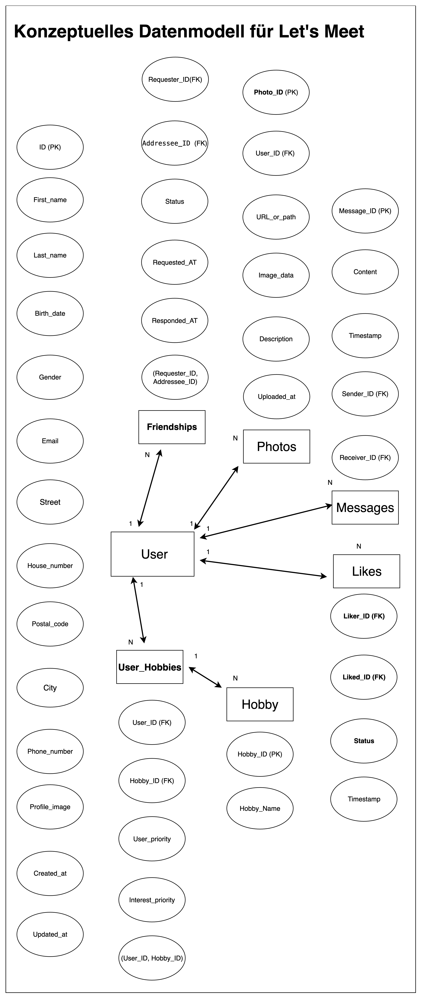
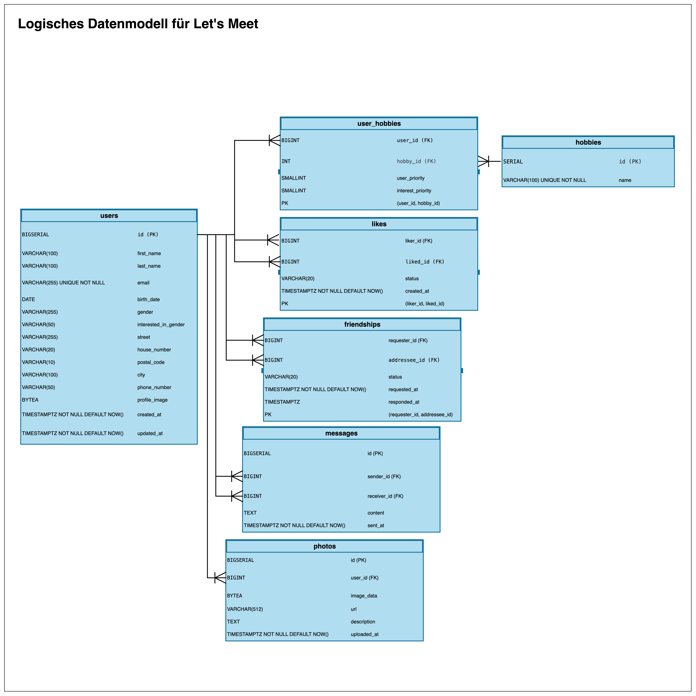

# Phase 1: Konzeptionelles & Logisches Datenmodell

## 1. Einleitung und Zielsetzung

Dieses Dokument bildet den ersten Schritt der Datenbankmigration für die Let's Meet GmbH. Grundlage dafür ist eine Analyse der bestehenden Datenquellen (Excel, MongoDB, XML) sowie eine Betrachtung der zukünftigen Anwendungsfälle.

Als Ergebnis liegt ein logisches Datenmodell in Form eines Entity-Relationship-Diagramms (ERD) vor. Dieses Modell dient als Grundlage für die anschließende Umsetzung in einer PostgreSQL-Datenbank. Ziel ist es, mit einer normalisierten und robusten Struktur spätere Probleme bei Datenoperationen (Ändern, Löschen, Einfügen) von vornherein zu vermeiden.

## 2. Datenmodell

## 3. Entwurfsentscheidungen

Das Modell orientiert sich an den Grundsätzen der Datenbanknormalisierung, insbesondere der 3. Normalform. Dadurch werden Redundanzen vermieden und die Datenintegrität gewährleistet.

- **Zentrale Entität `users`**:  
  Die `users`-Tabelle bildet den Kern des Modells und enthält alle Benutzerdaten.

- **Atomare Speicherung von Daten**:  
  Werte wie Name (`first_name`, `last_name`) und Adresse (`street`, `postal_code`, `city`) wurden in Einzelfelder zerlegt. So werden Filterungen und Sortierungen deutlich erleichtert.

- **Auslagerung von Hobbys**:  
  Die Tabelle `hobbies` sorgt für eine eindeutige Verwaltung von Hobby-Bezeichnungen.  
  Die Verknüpfungstabelle `user_hobbies` löst die n:m-Beziehung auf und ermöglicht gleichzeitig die Speicherung individueller Präferenzen oder Priorisierungen.

- **Beziehungsmodellierung**:  
  n:m-Beziehungen wie `likes` oder `friendships` werden über eigene Verknüpfungstabellen abgebildet. Dadurch lassen sich Zusatzinformationen wie der aktuelle `status` einer Freundschaftsanfrage flexibel speichern.

## 4. Datenschutz

### Rechtsgrundlage für die Datenverarbeitung

- **Primäre Rechtsgrundlage:** Art. 6 Abs. 1 lit. a DSGVO (Einwilligung)
- **Informierte Einwilligung:** Nutzer müssen ausdrücklich und verständlich über die Datenverarbeitung informiert werden und dieser zustimmen
- **Widerrufbarkeit:** Einwilligung muss jederzeit widerrufbar sein

### Datenkategorien im Projekt

#### Allgemeine personenbezogene Daten (Art. 6 DSGVO)

- **Stammdaten:** Name, E-Mail-Adresse, Postanschrift, Geburtsdatum
- **Kommunikationsdaten:** Private Nachrichten zwischen Nutzern
- **Interaktionsdaten:** Likes, Freundschaftsanfragen, Hobbys

#### Besonders sensible Daten (Art. 9 DSGVO)

- **Geschlecht und sexuelle Orientierung:** Geschlechtsidentität, Präferenzen bei der Partnersuche
- **Biometrische Daten:** Profilbilder und weitere hochgeladene Fotos

### Besonderer Schutzbedarf

Daten wie sexuelle Orientierung und private Nachrichten haben einen extrem hohen Schutzbedarf, da deren Missbrauch zu Diskriminierung oder erheblichen persönlichen Schäden führen kann.

### Schutzmaßnahmen

#### Technische Maßnahmen

- **Verschlüsselung:** Sichere Speicherung sensibler Daten
- **Passwort-Hashing:** Sichere Authentifizierung mit bcrypt/Argon2
- **HTTPS/TLS:** Verschlüsselte Datenübertragung
- **Backup-Verschlüsselung:** Sichere Datensicherung

#### Organisatorische Maßnahmen

- **Berechtigungskonzept:** Rollenbasierte Zugriffskontrolle
- **Datenschutzerklärung:** Transparente Information über Datenverarbeitung
- **Löschkonzept:** Automatische Löschung nach Kontodeaktivierung
- **Einwilligungsmanagement:** Granulare Einwilligungsoptionen
